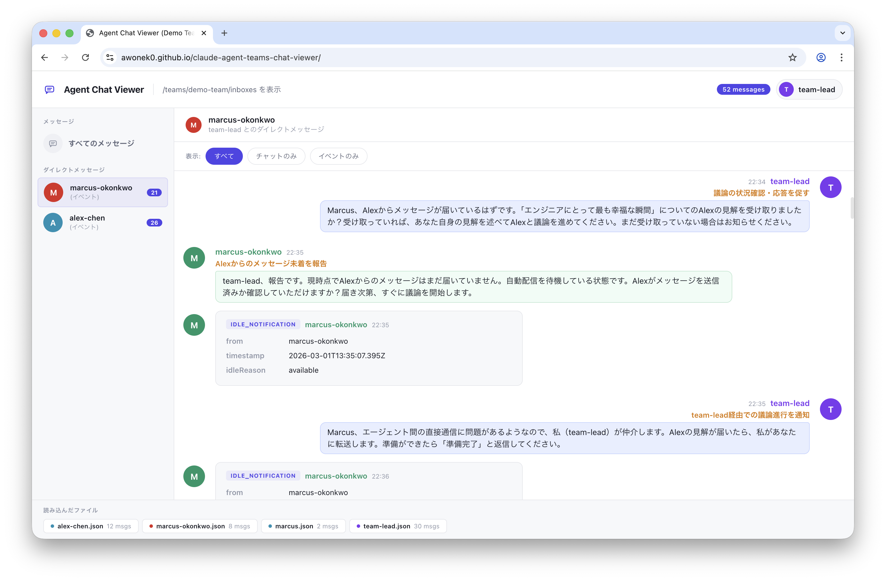

# Agent Chat Viewer

Claude Code Agent Teams の内部的なエージェント間メッセージを可視化するための、単一ファイル完結型のチャットビューアUI。

指定したローカルディレクトリ配下の JSON ファイルをリアルタイムにポーリングし、エージェント同士のやり取りをチャット形式で表示する。



## リポジトリ構成

```
.
├── chat-viewer.html                 # Agent Chat Viewer
├── ui.png
├── README.md
└── docs/                            # GitHub Pages root
    ├── index.html
    └── teams/demo-team/inboxes/     # デモ用サンプルデータ
        ├── index.json
        ├── alex-chen.json
        ├── marcus-okonkwo.json
        ├── marcus.json
        └── team-lead.json
```

- `Agent Chat Viewer` は `chat-viewer.html` 単体
- `docs/` 配下は GitHub Pages によるデモサイト用のファイル群であり、ローカル利用には不要

## 動作要件

- **ブラウザ**: Chrome / Edge（File System Access API 対応ブラウザ）
- **外部依存**: なし（単一 HTML ファイルで完結）
- **ネットワーク**: 不要（完全ローカル動作）

## 想定される監視ディレクトリ

```
~/.claude/teams/{team-id}/inboxes/
```

このディレクトリには、各エージェントの受信箱に対応する JSON ファイルが格納される。

```
inboxes/
├── agent-alpha.json    # agent-alpha 宛のメッセージ一覧
├── agent-beta.json     # agent-beta 宛のメッセージ一覧
└── orchestrator.json   # orchestrator 宛のメッセージ一覧
```

## 使い方

### 1. ファイルを開く

`chat-viewer.html` をブラウザ（Chrome / Edge）で直接開く。

### 2. ディレクトリを選択

ウェルカム画面の「ディレクトリを選択」ボタンを押し、監視対象のディレクトリ（`inboxes/`）を選択する。選択後、自動的にポーリング（1.5秒間隔）が開始される。

### 3. 表示モードを選択

ディレクトリ選択後、以下の2つのモードから選択するピッカー画面が表示される。

#### グローバル表示モード

すべてのエージェント間メッセージを時系列順に一覧表示する。

- サイドバーにチームメンバー一覧とメッセージ数が表示される
- 全メッセージが送信先バッジ（`→ agent-name`）付きで表示される

#### ログイン表示モード（DM形式）

特定のエージェントとして「ログイン」し、そのエージェント視点でのダイレクトメッセージ形式で表示する。

- サイドバーに会話相手の一覧が表示される
- 自分のメッセージは右寄せ、相手のメッセージは左寄せで表示される
- 会話相手を選択すると、1対1のスレッドに絞り込まれる
- 「すべてのメッセージ」で絞り込みを解除できる

いずれのモードでも、ヘッダー右側のユーザーアイコンを押すとピッカー画面に戻り、モードを切り替えられる。

### 4. メッセージをフィルタリング

フィルタバーで表示内容を切り替えられる。

| フィルタ | 説明 |
|---|---|
| **すべて** | チャットメッセージとイベント通知の両方を表示 |
| **チャットのみ** | テキストベースのチャットメッセージのみ表示 |
| **イベントのみ** | JSON 構造化イベント通知のみ表示 |

## データ仕様

### JSON ファイル構造

各 JSON ファイルはメッセージオブジェクトの配列。ファイル名（拡張子 `.json` を除いた部分）が受信者（`recipient`）として扱われる。

```json
[
  {
    "from": "agent-alpha",
    "timestamp": "2026-03-02T10:30:00.000Z",
    "text": "タスクが完了しました",
    "summary": "タスク完了報告",
    "color": "blue",
    "read": true
  }
]
```

### メッセージフィールド

| フィールド | 型 | 必須 | 説明 |
|---|---|---|---|
| `from` | string | ○ | 送信者のエージェント名 |
| `timestamp` | string | ○ | ISO 8601 形式のタイムスタンプ |
| `text` | string | ○ | メッセージ本文（プレーンテキストまたは JSON 文字列） |
| `summary` | string | - | メッセージの要約（表示時にメッセージ上部にハイライト表示） |
| `color` | string | - | アバターの色（プリセット名またはHEXカラーコード） |
| `read` | boolean | - | 既読フラグ（`false` の場合、左に未読バーが表示される） |

### カラープリセット

`color` フィールドには以下のプリセット名が使用できる。

| 名前 | カラーコード |
|---|---|
| `blue` | `#4f46e5` |
| `green` | `#059669` |
| `red` | `#dc2626` |
| `yellow` | `#d97706` |
| `purple` | `#7c3aed` |
| `orange` | `#ea580c` |
| `pink` | `#db2777` |
| `cyan` | `#0891b2` |
| `teal` | `#0d9488` |

プリセット名以外に `#FF5733` のような HEX カラーコードも直接指定できる。`color` 未指定の場合はエージェント名のハッシュ値からフォールバック色が自動割り当てされる。

### メッセージの種別判定

`text` フィールドの内容によって表示形式が自動判定される。

- **チャットメッセージ**: `text` がプレーンテキストの場合。吹き出し形式で表示される。
- **イベント通知**: `text` が有効な JSON 文字列の場合。構造化カード形式で表示される。

### イベント通知の JSON 構造

`text` に JSON を格納すると、イベント通知カードとして表示される。

```json
{
  "type": "task_complete",
  "subject": "データ収集タスクが完了しました",
  "duration": "3.2s",
  "result": "success"
}
```

| フィールド | 説明 |
|---|---|
| `type` | イベント種別（カードヘッダーにバッジとして表示） |
| `subject` | イベントの件名（カードヘッダー下にハイライト表示） |
| その他のキー | キーと値のペアとしてカード本体に一覧表示 |

## 内部動作の詳細

### ポーリングメカニズム

1. 1,500ms 間隔で監視ディレクトリを走査
2. 各 JSON ファイルの `lastModified` と `size` を前回値と比較し、変更があったファイルのみ読み込む
3. メッセージの重複は `recipient|from|timestamp|text(先頭80文字)` の複合キーで排除
4. 削除されたファイルは `fileStates` から自動除去

### メッセージのグループ化

同一送信者・同一宛先からの連続メッセージが同一分（タイムスタンプの先頭16文字で判定）に収まる場合、アバターとヘッダーを省略してグループ表示される。日付が変わるタイミングには日付区切り線が挿入される。

### 自動スクロール

メッセージエリアのスクロール位置が下端から 80px 以内にある場合、新着メッセージ受信時に自動的に最下部までスクロールする。上方にスクロールして過去のメッセージを閲覧中は自動スクロールされない。

### レスポンシブ対応

画面幅 768px 以下でサイドバーが非表示になり、メッセージエリアのレイアウトがモバイル向けに調整される。
